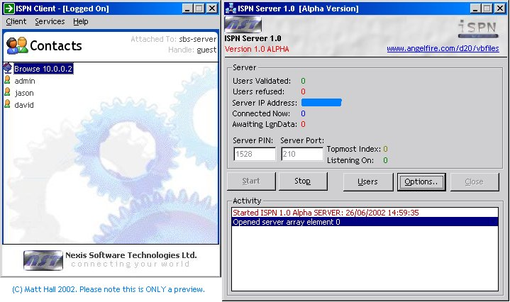



## ISPN 1\.0 Alpha \(Update a\)

### Description

**UPDATED - Removed the unused old project file. Debugged server [kick user]** Allows client\server communication via a network (LAN or WAN [Internet]) using protocol ISPN 1.0 using a TCP\IP [TCPIP TCP IP] connection method.

You can currently; Send and recieve Instant Messages, View general information about a user, Connect multiple users to the ISPN server, See connected users and disconnect any user. Please run the product to find more out about ISPN. You might like to also visit my website at www.angelfire.com/d20/vbfiles. The code also demonstrates extracting multiple values\fields from one string. PLEASE NOTE: The project file for the client is Contacts.vbp, not the other one. There is only one sever project file. ISPN Server does not work on Windows NT. It is tested on Windows 2000, 2000 Server, Windows 98 and Windows XP. Client should run on all 32-Bit Windows operating systems. Im really looking for feedback on this one to keep my motivation up! :p
 
### More Info
 
Client: /STARTUP will start client hidden.

Requires MSCOMCTL.OCX, MSWINSCK.OCX and generic run-times found at www.microsoft.com.

             |
---                |---
**Submitted On**   |2002-06-28 11:05:02
**By**             |[ByteForce UK](https://github.com/Planet-Source-Code/PSCIndex/blob/master/ByAuthor/byteforce-uk.md)
**Level**          |Advanced
**User Rating**    |4.6 (46 globes from 10 users)
**Compatibility**  |VB 6\.0
**Category**       |[Complete Applications](https://github.com/Planet-Source-Code/PSCIndex/blob/master/ByCategory/complete-applications__1-27.md)
**World**          |[Visual Basic](https://github.com/Planet-Source-Code/PSCIndex/blob/master/ByWorld/visual-basic.md)
**Archive File**   |[ISPN\_1\_0\_A997446282002\.zip](https://github.com/Planet-Source-Code/byteforce-uk-ispn-1-0-alpha-update-a__1-36282/archive/master.zip)

